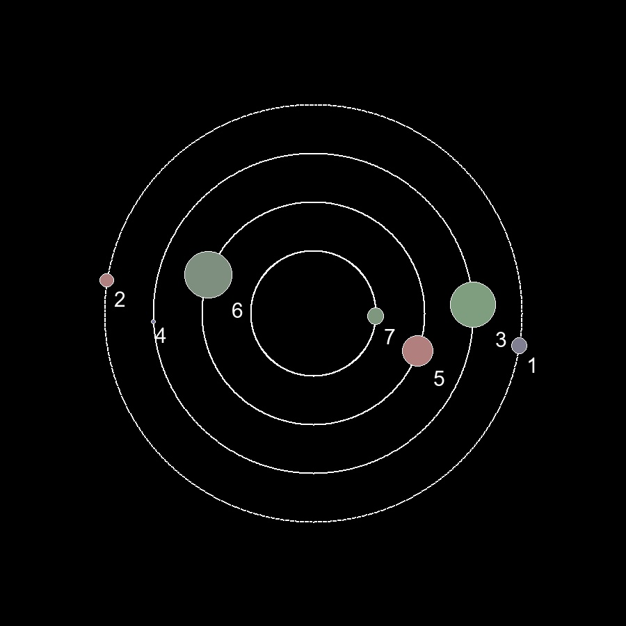

# Planets Generator Version 1

---
## О проекте:
```
Данный проект предназначен для генерации планет/планетарных систем 
или целых галактик.
```
## Планеты:
Каждая планета имеет:
- Температуру (Измеряется в Цельсиях)
- Имя (Генерируется рандомно)
- Размер (Диаметр планеты. Измеряется в км). Размеры планеты делятся на 3 вида:
```
Карликовая планета
Средняя планета
Газовый гигант
```
- Тип планеты. Планета может быть:
```
Снежная 
Ледяная
Токсичная 
Радиационная
Ядерная
Мертвая
Каменная
Водная
Пустынная
```
Тип планеты подбирается в зависимости от её температуры.

- Тип ландшавта планеты. Тип ландшафта может быть:
```
Равнинным
Холмистым
Горным
```
- Гравитация планеты (Измеряется в Ньютонах)
- Вероятность зарождения живых аргонизмов на планете. (На данный момент только True/False)
- Время зарождения планеты.

## Планетные системы:
Каждая планетная система имеет:
- Имя (Генерируется рандомно)
- Список всех планет и их характеристик

Цвет планеты может зависить от её температуры.

```
Чем более планета зеленая, 
тем она пригоднее для появления на ней жизни. 
Планеты с красным и синим оттенком означают обратное.
```

### Пример:


Также вместе с картинкой, в консоли будут характиристики каждой планеты.

## Галактики:
Каждая галактика имеет:
- Имя (Генерируется рандомно)
- Диаметр галактики (В св. годах)

### Пример:


Также вместе с картинкой, в консоли будут характиристики данной галактики.